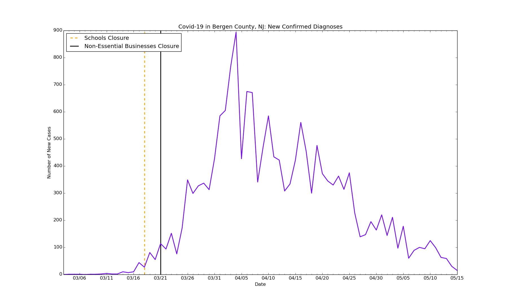
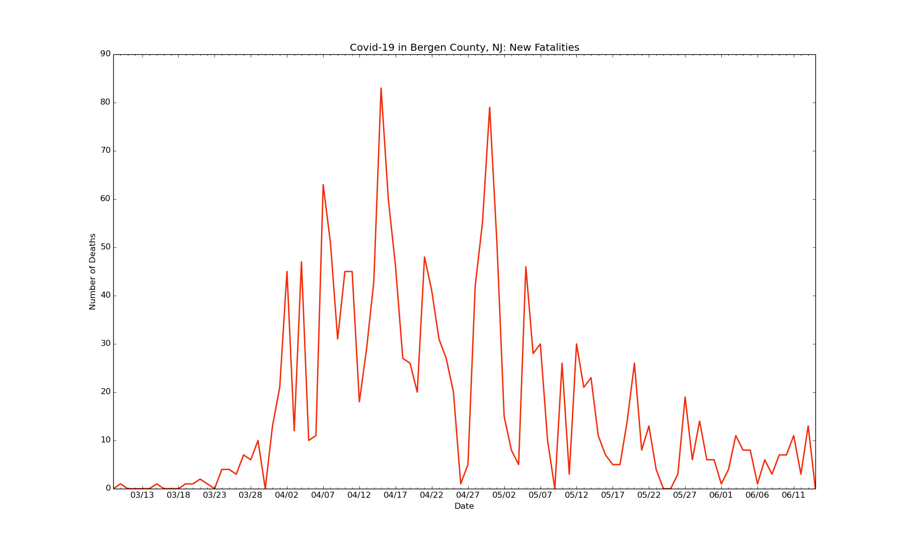
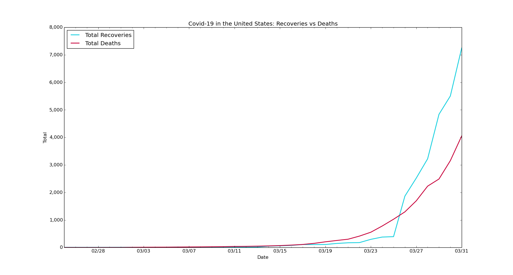
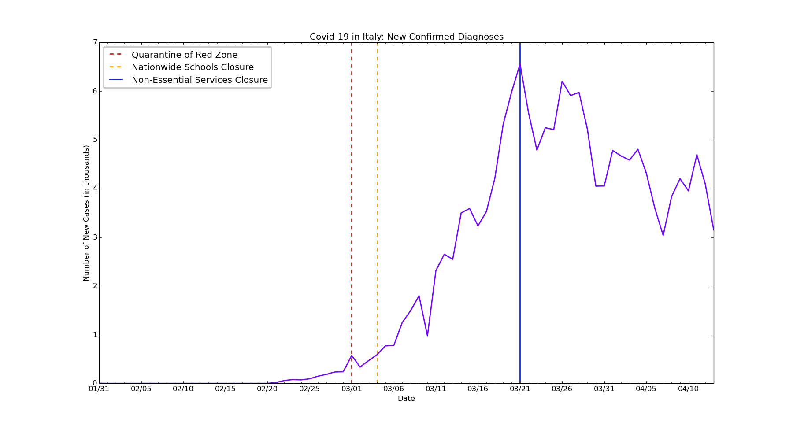
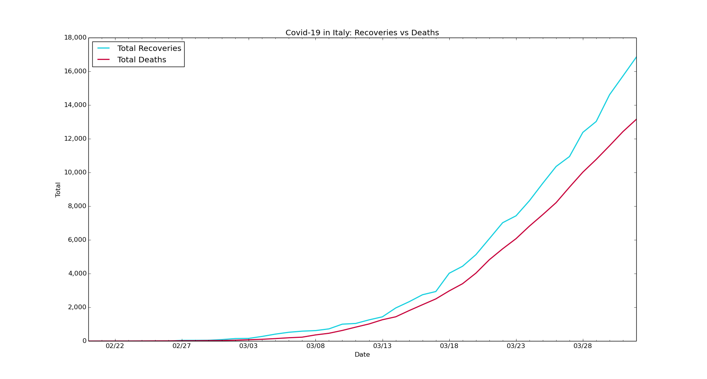

# covid19-epicenters
Data visualization on the epicenters of the global Covid-19 outbreak, using Python and Matplotlib

Data Last Updated for April 3, 2020

**Key Insights for New York City:**

**Key Insights for Bergen County, New Jersey:**

**Key Insights for the United States:**

**Key Insights for Italy:**

Data for NYC and Bergen County collected manually via various news sources (specifics available upon request). Data for the United States collected mainly from [Worldometer](https://www.worldometers.info/coronavirus/country/us/).
