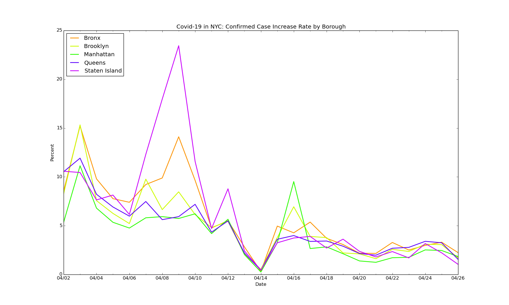
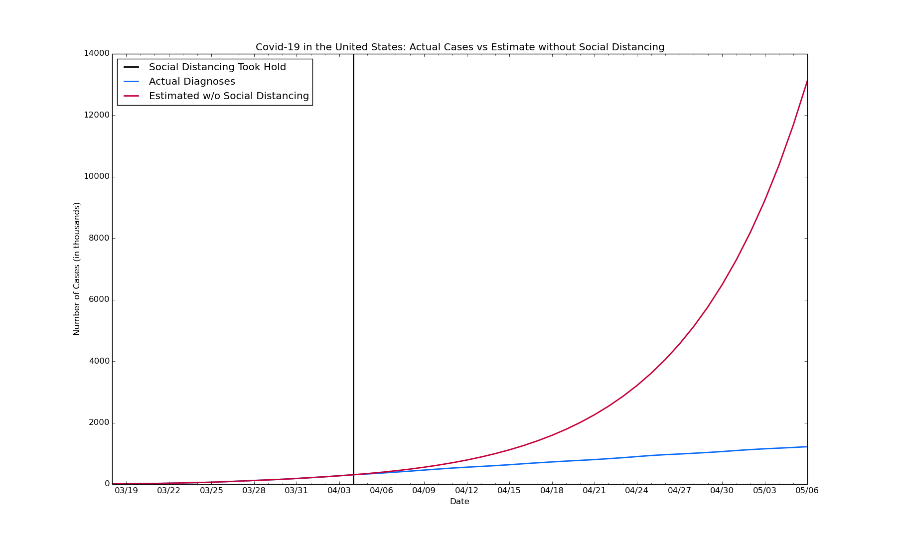
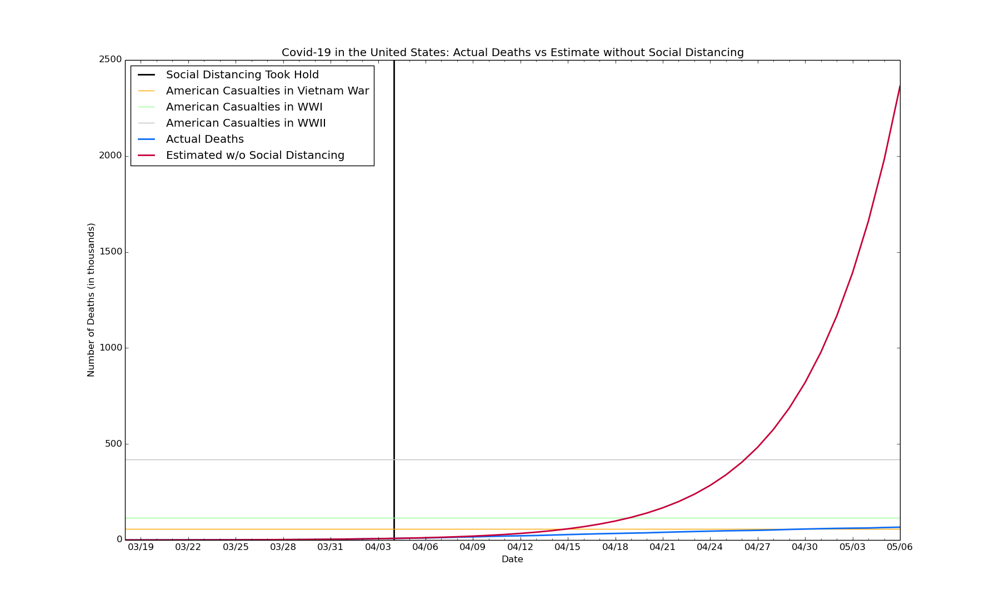
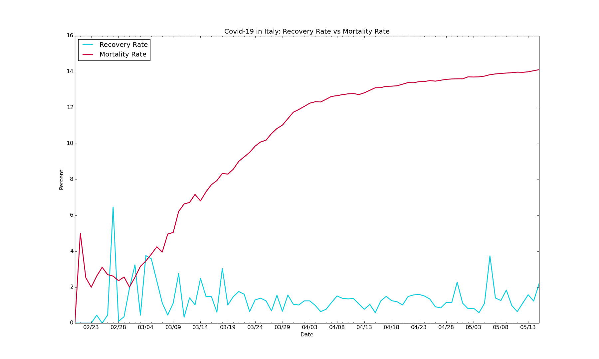

# covid19-epicenters
Data visualization on the epicenters of the global Covid-19 outbreak, using Python and Matplotlib

Data Last Updated for April 19, 2020

**Key Insights for New York City:**

Data sourced from: various (available upon request), and [the NYC Department of Health and Mental Hygiene (DOHMH) Incident Command System for COVID-19 Response](https://github.com/nychealth/coronavirus-data)

**Key Insights for Bergen County, New Jersey:**

Data sourced from: various (available upon request)

**Key Insights for the United States:**

Data sourced from: [Wikipedia](https://en.wikipedia.org/wiki/2020_coronavirus_pandemic_in_Italy)  
Due to selected state lockdowns, social distancing began to slow the overall rate of new infections as of April 4th. The graphs below compare the current cases and deaths vs what each would be if they increased at the same rates as they had been as of April 4th.

**Key Insights for Italy:**

Data sourced from: [Wikipedia](https://en.wikipedia.org/wiki/2020_coronavirus_pandemic_in_Italy)
