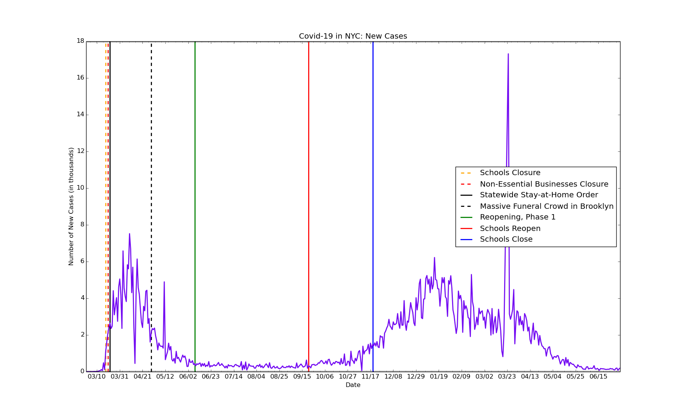
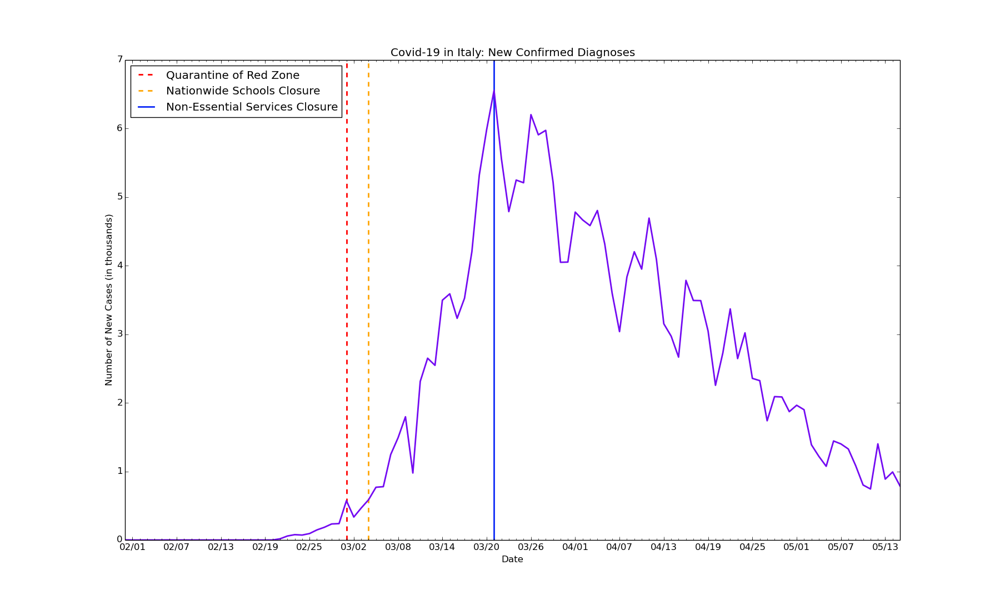

# covid19-epicenters
Data visualization on the epicenters of the global Covid-19 outbreak, using Matplotlib

Data Last Updated March 28, 2020

**Sample Insights for New York City:**

**Sample Insights for Bergen County, New Jersey:**

**Sample Insights for the United States:**

**Sample Insights for Italy:**

All graphs were created in Python, using Matplotlib.

Data for NYC and Bergen County collected manually via various news sources. Data for the United States collected mainly via [Worldometer](https://www.worldometers.info/coronavirus/country/us/).
