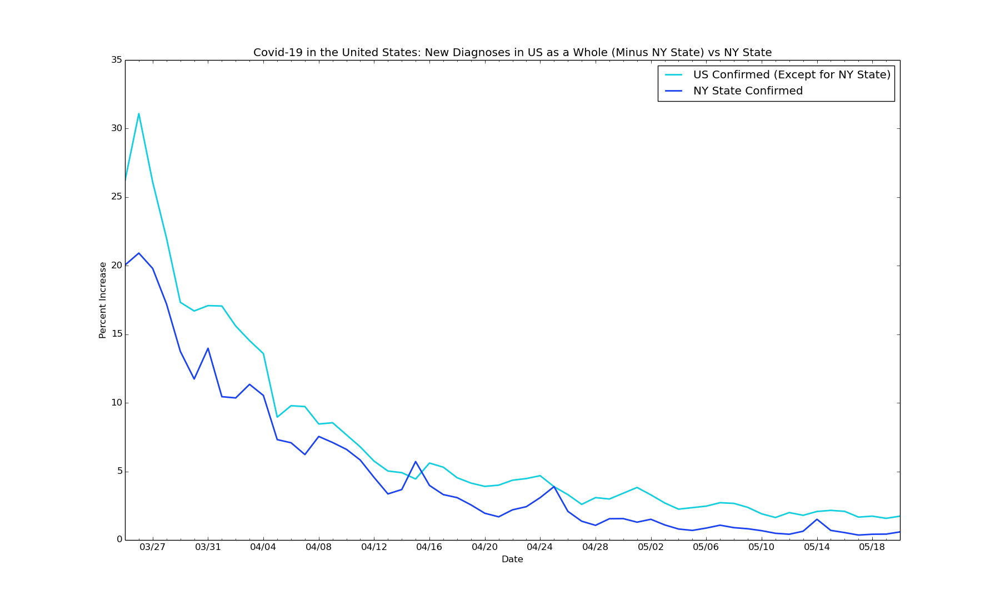
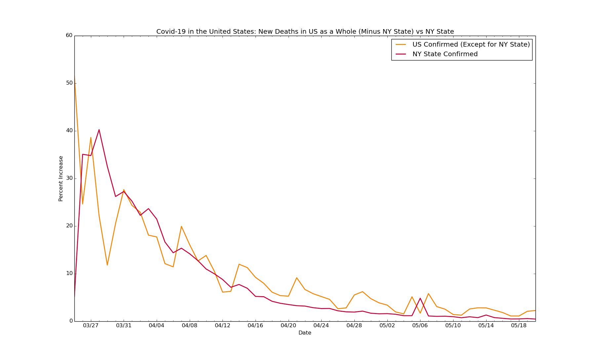

# covid19-epicenters
Data visualization on the epicenters of the global Covid-19 outbreak, using Python and Matplotlib

Data last updated for May 21, 2020, except data for NY State graph, which is updated to May 20th

**Key Insights for New York City:**

Data sourced from: various (available upon request), and [the NYC Department of Health and Mental Hygiene (DOHMH) Incident Command System for COVID-19 Response](https://github.com/nychealth/coronavirus-data)

**Key Insights for Bergen County, New Jersey:**

Data sourced from: various (available upon request)

**Key Insights for the United States:**

Data sourced from: [Wikipedia](https://en.wikipedia.org/wiki/2020_coronavirus_pandemic_in_Italy)

 

**Key Insights for the UK:**

Data sourced from: [Wikipedia](https://en.wikipedia.org/wiki/Timeline_of_the_2020_coronavirus_pandemic_in_the_United_Kingdom)
