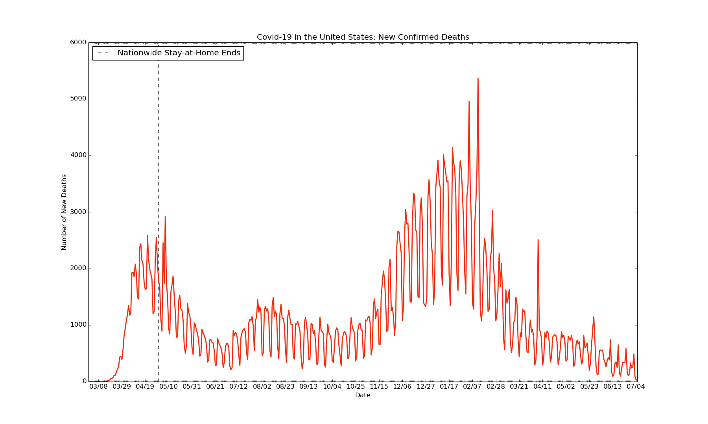

# covid19-epicenters

Data visualization on the epicenters of the global Covid-19 outbreak, using Python and Matplotlib

Data last updated for November 13, 2020

### Key Insights for New York City:

Data sourced from: various (available upon request), and [the NYC Department of Health and Mental Hygiene (DOHMH) Incident Command System for COVID-19 Response](https://github.com/nychealth/coronavirus-data)

### Key Insights for the United States:

Data sourced from: [Wikipedia](https://en.wikipedia.org/wiki/Template:2019%E2%80%9320_coronavirus_pandemic_data/United_States_medical_cases)
